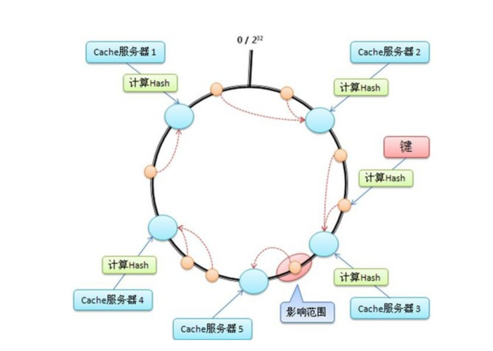

# 一致性hash

## **一 引言**

hash的意思是散列，目的将一组输入的数据均匀的分开、打散，往往用来配合路由算法做负载均衡，多用在分布式系统中。当前memcached，redis这类分布式kv缓存已经非常普遍。我们知道memcached的分布式其实是一种"伪分布式"，也就是它的服务器节点之间其实是无关联的，之间没有网络拓扑关系，由客户端来决定一个key要存放在哪台机器。

具体来讲，假设我们有多台memcached服务器，编号分别为m0, m1, m2.. 对于一个key，由客户端来决定存放到哪台机器，最简单的办法就是key % N, 其中N是机器的总数

但是有一个问题，一旦机器数增加或减少，N发生变化，key去mod新旧N得到的机器编号大概率不相等，那么之前存放的数据就全部无效了。

## **二 hash环**

基于上面的问题，提出了hash环的概念。hash环的过程有两次hash

(1) 把所有的机器编号hash到这个环上

(2) 把key也hash到这个环上，然后在这个环上进行匹配，看这个key和哪台机器匹配

 

具体过程是这样： 假定有一个hash函数，其值空间为(0 ~ 2^32-1)。也就是说，其hash值是个32位无整型数字，这些数字组成一个环。首先对机器进行hash(比如根据机器ip)，算出每台机器在这个环上的位置; z再对key进行hash，算出该key在环上的位置，然后从这个位置往前走，遇到的第一台机器就是该key对应的机器，就把该(key, value)存储到该机器上，如下图所示。

首先计算出每台cache服务器在环上的位置(图中浅蓝色的大圆圈)，然后每来一个key计算出value填到环上的位置(图中橙色的小圆圈)，然后顺时针走，遇到的第一个机器，就是要存储的机器

这里的关键点是:当机器数N变化时，其他机器在环上的位置并不会发生改变。这样只有增加/减少的那台机器附近的数据会失效，其他机器上的数据还是有效的。

## **三 数据倾斜问题**

当机器不很多时，很可能出现几台机器在环上面贴的很近，分布很不均匀。这将会导致大部门数据集中在某几台机器上。

为了解决这个问题，可以引入"虚拟机器"的概念，也就是说，一台机器需要在环上映射出多个位置。比如我们用机器的ip来hash，那么我们可以在ip后面加几个编号，形如ip_1, ip_2, ip_3... 这样就实现了一台物理机器映射出了多个虚拟机器的编号。

数据首先映射到"虚拟机器"上，再从"虚拟机器"映射到物理机器上。因为虚拟机器可以很多，在环上均匀分布，从而保证数据相对均匀地分布在物理机器上。

 

## **四 zk的引入**

上面我们提到了服务器的机器数N的变化，那么如何通知到客户端呢

一种笨方法就是手动，当机器数N变化，重新配置客户端，重启客户端。

另外一种，引入zk，服务器的节点列表注册到zk上面，客户端监听zk。发现节点数发生变化，自动更新自己的配置。

当然不用zk用一个其他的中心节点也可以，只要能实现这种更改的通知即可（也即分布式服务协调）