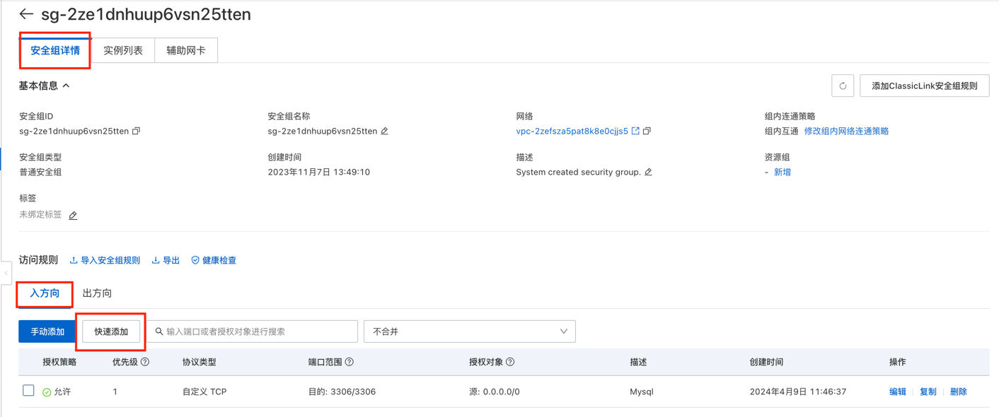
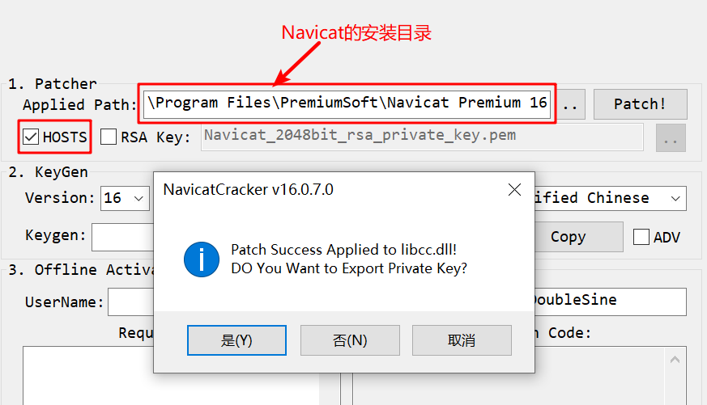

# Alibaba ECS 安装Mysql

前提条件

已经拥有一台阿里云ECS服务器。
拥有外网IP。（如果需要外网连接）

操作系统
Alibaba Cloud Linux 3.2104 LTS 64位

## 步骤一：安装MySQL

1、运行以下命令，更新YUM源。
```Bash
sudo rpm -Uvh https://dev.mysql.com/get/mysql80-community-release-el7-3.noarch.rpm
```

2、运行以下命令，安装MySQL。

```Bash
sudo yum -y install mysql-community-server --enablerepo=mysql80-community --nogpgcheck
```
3、运行以下命令，查看MySQL版本号。
```Bash
mysql -V
```

4、返回结果如下，表示MySQL安装成功。

```Bash
[root@v-hudson-1 ~]# mysql -V
mysql  Ver 8.0.36 for Linux on x86_64 (MySQL Community Server - GPL)
```

## 步骤二：配置MySQL

1、运行以下命令，启动MySQL服务。

```Bash
sudo systemctl start mysqld
```

2、运行如下命令查看Mysql启动状态
```Bash
[root@v-hudson-1 ~]# sudo systemctl status  mysqld
● mysqld.service - MySQL Server
   Loaded: loaded (/usr/lib/systemd/system/mysqld.service; enabled; vendor preset: enabled)
   Active: active (running) since Tue 2024-04-09 11:31:18 CST; 33s ago
     Docs: man:mysqld(8)
           http://dev.mysql.com/doc/refman/en/using-systemd.html
  Process: 392673 ExecStartPre=/usr/bin/mysqld_pre_systemd (code=exited, status=0/SUCCESS)
 Main PID: 392752 (mysqld)
   Status: "Server is operational"
    Tasks: 38 (limit: 11849)
   Memory: 476.1M
   CGroup: /system.slice/mysqld.service
           └─392752 /usr/sbin/mysqld

4月 09 11:31:08 v-hudson-1 systemd[1]: Starting MySQL Server...
4月 09 11:31:18 v-hudson-1 systemd[1]: Started MySQL Server.
```

3、运行以下命令，设置MySQL服务开机自启动。
```Bash
sudo systemctl enable mysqld
```

运行以下命令，查看/var/log/mysqld.log文件，获取并记录root用户的初始密码。

```Bash
sudo grep 'temporary password' /var/log/mysqld.log
```

4、执行命令结果示例如下。
```Bash
[root@v-hudson-1 ~]# sudo grep 'temporary password' /var/log/mysqld.log
2024-04-09T03:31:13.610361Z 6 [Note] [MY-010454] [Server] A temporary password is generated for root@localhost: B:lWdug;g4D_
```
示例末尾的`B:lWdug;g4D_`为初始密码，后续在对MySQL进行安全性配置时，需要使用该初始密码。

5、运行下列命令，对MySQL进行安全性配置。

```Bash
sudo mysql_secure_installation
```

6、根据提示信息，重置MySQL数据库root用户的密码。

> 说明 在输入密码时，系统为了最大限度的保证数据安全，命令行将不做任何回显。您只需要输入正确的密码信息，然后按Enter键即可。

```Bash
[root@v-hudson-1 ~]# sudo mysql_secure_installation

Securing the MySQL server deployment.

Enter password for user root: #输入已获取的root用户初始密码

The existing password for the user account root has expired. Please set a new password.

New password: #输入新的MySQL密码

Re-enter new password: #重复输入新的MySQL密码

The 'validate_password' component is installed on the server.
The subsequent steps will run with the existing configuration
of the component.
Using existing password for root.

Estimated strength of the password: 100
Change the password for root ? ((Press y|Y for Yes, any other key for No) : y # 是否更新root用户账号密码

New password: #输入新的MySQL密码

Re-enter new password: #重复输入新的MySQL密码

Estimated strength of the password: 100
Do you wish to continue with the password provided?(Press y|Y for Yes, any other key for No) : y
By default, a MySQL installation has an anonymous user,
allowing anyone to log into MySQL without having to have
a user account created for them. This is intended only for
testing, and to make the installation go a bit smoother.
You should remove them before moving into a production
environment.

Remove anonymous users? (Press y|Y for Yes, any other key for No) : y #输入Y删除MySQL默认的匿名用户。
Success.


Normally, root should only be allowed to connect from
'localhost'. This ensures that someone cannot guess at
the root password from the network.

Disallow root login remotely? (Press y|Y for Yes, any other key for No) : y #输入Y禁止root远程登录。
Success.

By default, MySQL comes with a database named 'test' that
anyone can access. This is also intended only for testing,
and should be removed before moving into a production
environment.


Remove test database and access to it? (Press y|Y for Yes, any other key for No) : y  #输入Y删除test库以及对test库的访问权限。
 - Dropping test database...
Success.

 - Removing privileges on test database...
Success.

Reloading the privilege tables will ensure that all changes
made so far will take effect immediately.

Reload privilege tables now? (Press y|Y for Yes, any other key for No) : y #输入Y重新加载授权表。
Success.

All done!
```

## 步骤三：远程访问MySQL数据库
1. 为ECS实例所属的安全组入方向放行MySQL所需的端口号。 MySQL默认占用的端口号为3306。您需要在ECS实例所使用的安全组入方向添加规则并放行3306端口。具体步骤，请参见添加安全组规则。 在阿里云ECS服务器控制台设置安全组开放Mysql默认的3306端口




2. 在ECS实例上，创建远程登录MySQL的账号。 运行以下命令后，输入root用户的密码登录MySQL。
```Bash
# 使用root登录数据库
sudo mysql -uroot -p

# 创建xxx用户，允许远程连接，password 替换为具体的登录密码。
create user 'xxx'@'%' identified by 'password'; 

#为xxx用户授权可以访问所有数据库，所有表。
grant all privileges on *.* to 'xxx'@'%'; 

#刷新权限。
flush privileges; 

# 执行以下命令，退出数据库。
exit
```
此命令中的xxx 表示用户名，`%` 表示允许远程连接，password 替换为具体的登录密码。
除了`%`还有`localhost`表示只允许本地连接。例如:
```Bash
# 表示创建用户xxx,并且只能本地连接，密码为password
create user 'xxx'@'localhost' identified by 'password'; 
```

```Bash
# 此命令中的on *.* 前一个*表示具体的数据库，*是通配符表示所有的数据库，后一个*表示具体的表，*是通配符表示所有的表
grant all privileges on *.* to 'xxx'@'%'; 

# 举个例子：
# 此命令表示允许xxx用户远程连接，并且只能访问school数据库的user表
grant all privileges on school.user to 'xxx'@'%'; 
```

3. 结束。然后就可以用过数据库连接工具等方式连接数据库了。

题外话：

可以通过命令查看mysql已有的用户信息。

```Bash
# 使用root登录数据库
sudo mysql -uroot -p

# 选择数据库
mysql> use mysql;

# 写SQL查询信息 
mysql> select host ,user,authentication_string,plugin from user;
+-----------+------------------+------------------------------------------------------------------------+-----------------------+
| host      | user             | authentication_string                                                  | plugin                |
+-----------+------------------+------------------------------------------------------------------------+-----------------------+
| %         | xxx              | $A$005$V5mf0u6xo^|#U(@Q:G2iUo9wjbQoPEm/rmzlhxLU5w.DEpePr1emHXT0cH6cA   | caching_sha2_password |
| localhost | mysql.infoschema | $A$005$THISISACOMBINATIONOFINVALIDSALTANDPASSWORDTHATMUSTNEVERBRBEUSED | caching_sha2_password |
| localhost | mysql.session    | $A$005$THISISACOMBINATIONOFINVALIDSALTANDPASSWORDTHATMUSTNEVERBRBEUSED | caching_sha2_password |
| localhost | mysql.sys        | $A$005$THISISACOMBINATIONOFINVALIDSALTANDPASSWORDTHATMUSTNEVERBRBEUSED | caching_sha2_password |
| localhost | root             | $A$005$0>9oZ0oY/VkdbIDdhMxjVXIAWYuMzm2b1rsuY8OFiwi4x4                  | caching_sha2_password |
+-----------+------------------+------------------------------------------------------------------------+-----------------------+
5 rows in set (0.00 sec)
```

1. 表中的host 表示访问方式。%代表所有。localhost仅限本地。
2. user，用户名
3. authentication_string 加密后的密码
4. plugin，mysql的加密方式

如果你想要修改用户密码，你可以使用如下命令：

```Bash
SET PASSWORD FOR 'user'@'localhost' = PASSWORD('new_password')
```


