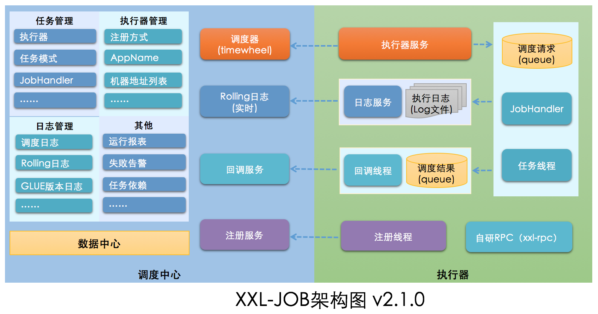
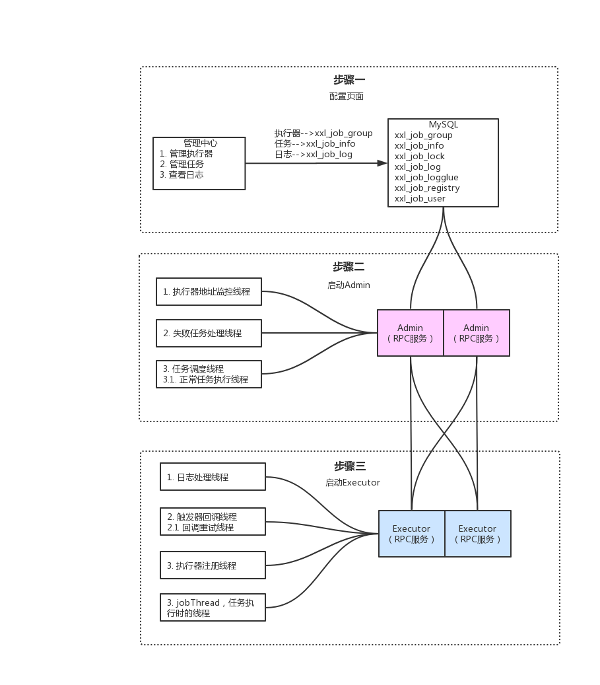

# xxl-job分布式定时任务

https://www.pppet.net/

在线生成corn表达式网址

为什么需要分布式定时任务？

spring 的定时任务有哪些缺陷？

1.不支持高可用。

2.不支持动态修改定时循环的时间点

3.不支持动态传参

为什么使用xxl-job?

1.定时任务的三大要素：触发器，任务，执行器

2.可以通过分布式锁（redis）实现HA

2.路由策略

xxl-job 为什么要额外暴露一个端口用于通信？

如何实现阻塞策略 java并发编程 阻塞队列

select * from xxl_job_lock where lock_name = 'schedule_lock' for update

排它锁

选中某一个行的时候,如果是通过主键id选中的。那么这个时候是行级锁。 其他的行还是可以直接insert 或者update的。

　　如果是通过其他的方式选中行,或者选中的条件不明确包含主键。这个时候会锁表。其他的事务对该表的任意一行记录都无法进行插入或者更新操作。只能读取。

# **xxl-job**

### **系统说明**

#### **安装**

安装部署参考文档：[分布式任务调度平台xxl-job](http://www.xuxueli.com/xxl-job/#/?id=《分布式任务调度平台xxl-job》)

#### **源码仓库地址**

| **源码仓库地址**                     |
| ------------------------------------ |
| https://github.com/xuxueli/xxl-job   |
| http://gitee.com/xuxueli0323/xxl-job |

**功能**

定时调度、服务解耦、灵活控制跑批时间（停止、开启、重新设定时间、手动触发）

XXL-JOB是一个轻量级分布式任务调度平台，其核心设计目标是开发迅速、学习简单、轻量级、易扩展。现已开放源代码并接入多家公司线上产品线，开箱即用

#### **概念**

执行器列表：一个执行器是一个项目

任务：一个任务是一个项目中的 JobHandler

一个xxl-job服务可以有多个执行器（项目），一个项目下可以有多个任务（JobHandler），他们是如何关联的？

**页面操作：**

1. 在管理平台可以新增执行器（项目）
2. 在任务列表可以指定执行器（项目）下新增多个任务（JobHandler）

**代码操作：**

1. 项目配置中增加 xxl.job.executor.appname = "执行器名称"
2. 在实现类中增加 @JobHandler(value="xxl-job-demo") 注解，并继承 IJobHandler

#### **架构图**



### **抛出疑问**

1. 调度中心启动过程？
2. 执行器启动过程？
3. 执行器如何注册到调度中心？
4. 调度中心怎么调用执行器？
5. 集群调度时如何控制一个任务在该时刻不会重复执行
6. 集群部署应该注意什么？

### **系统分析**

#### **执行器依赖jar包**

com.xuxueli:xxl-job-core:2.1.0

com.xuxueli:xxl-registry-client:1.0.2

com.xuxueli:xxl-rpc-core:1.4.1

#### **调度中心启动过程**

```java
// 1. 加载 XxlJobAdminConfig，adminConfig = this

XxlJobAdminConfig.java

// 启动过程代码

@Component

public class XxlJobScheduler {

  private static final Logger logger = LoggerFactory.getLogger(XxlJobScheduler.class);

  public void init() throws Exception {

    // init i18n

    initI18n();

    // admin registry monitor run

    //启动注册监控器（将注册到register表中的IP加载到group表）/ 30执行一次 注册心跳等监控

    JobRegistryMonitorHelper.getInstance().start();

    // admin fail-monitor run

    //启动失败日志监控器（失败重试，失败邮件发送）

    JobFailMonitorHelper.getInstance().start();

    // admin lose-monitor run

    //任务结果丢失处理：调度记录停留在 "运行中" 状态超过10min，且对应执行器心跳注册失败不在线，则将本地调度主动标记失败；

    JobLosedMonitorHelper.getInstance().start();

    // admin trigger pool start

    //初始化两个线程池

    JobTriggerPoolHelper.toStart();

    // admin log report start

    //

    JobLogReportHelper.getInstance().start();

    // start-schedule

    //启动定时任务调度器（执行任务，缓存任务）

    JobScheduleHelper.getInstance().start();

    logger.info(">>>>>>>>> init xxl-job admin success.");

  }
```

#### **执行器启动过程**

```java
@Override

public void start() throws Exception {

    // init JobHandler Repository

  // 将执行 JobHandler 注册到缓存中 jobHandlerRepository（ConcurrentMap）

    initJobHandlerRepository(applicationContext);
    
    // refresh GlueFactory

  // 刷新GLUE

    GlueFactory.refreshInstance(1);
    
    // super start

  // 核心启动项

    super.start();

}

public void start() throws Exception {

  // 初始化日志路径

  // private static String logBasePath = "/data/applogs/xxl-job/jobhandler";

    XxlJobFileAppender.initLogPath(this.logPath);

  // 初始化注册中心列表 （把注册地址放到 List）

    this.initAdminBizList(this.adminAddresses, this.accessToken);

  // 启动日志文件清理线程 （一天清理一次）

  // 每天清理一次过期日志，配置参数必须大于3才有效

    JobLogFileCleanThread.getInstance().start((long)this.logRetentionDays);

  // 开启触发器回调线程

    TriggerCallbackThread.getInstance().start();

  // 指定端口

    this.port = this.port > 0 ? this.port : NetUtil.findAvailablePort(9999);

  // 指定IP

    this.ip = this.ip != null && this.ip.trim().length() > 0 ? this.ip : IpUtil.getIp();

  // 初始化RPC 将执行器注册到调度中心 30秒一次

    this.initRpcProvider(this.ip, this.port, this.appName, this.accessToken);

}
```

**执行器注册到调度中心**

执行器

```java
// 注册执行器入口

XxlJobExecutor.java->initRpcProvider()->xxlRpcProviderFactory.start();

// 开启注册

XxlRpcProviderFactory.java->start();

// 执行注册

ExecutorRegistryThread.java->start();

// RPC 注册代码

for (AdminBiz adminBiz: XxlJobExecutor.getAdminBizList()) {

    try {
    
        ReturnT<String> registryResult = adminBiz.registry(registryParam);
    
        if (registryResult!=null && ReturnT.SUCCESS_CODE == registryResult.getCode()) {
    
            registryResult = ReturnT.SUCCESS;
    
            logger.debug(">>>>>>>>>>> xxl-job registry success, registryParam:{}, registryResult:{}", new Object[]{registryParam, registryResult});
    
            break;
    
        } else {
    
            logger.info(">>>>>>>>>>> xxl-job registry fail, registryParam:{}, registryResult:{}", new Object[]{registryParam, registryResult});
    
        }
    
    } catch (Exception e) {
    
        logger.info(">>>>>>>>>>> xxl-job registry error, registryParam:{}", registryParam, e);
    
    }

}
```

调度中心

```java
// RPC 注册服务

AdminBizImpl.java->registry();
```

数据库


#### **调度中心调用执行器**

```java
/* 调度中心执行步骤 */
// 1. 调用执行器
XxlJobTrigger.java->runExecutor();


// 2. 获取执行器
XxlJobScheduler.java->getExecutorBiz();


// 3. 调用
ExecutorBizImpl.java->run();


/* 执行器执行步骤 */
// 1. 执行器接口
ExecutorBiz.java->run();


// 2. 执行器实现
ExecutorBizImpl.java->run();


// 3. 把jobInfo 从 jobThreadRepository (ConcurrentMap) 中获取一个新线程，并开启新线程
XxlJobExecutor.java->registJobThread();


// 4. 保存到当前线程队列
JobThread.java->pushTriggerQueue();


// 5. 执行
JobThread.java->handler.execute(triggerParam.getExecutorParams());
```

### **调度中心（Admin）**

实现 org.springframework.beans.factory.InitializingBean类，重写 afterPropertiesSet 方法，在初始化bean的时候都会执行该方法

DisposableBean spring停止时执行

**结束加载项**

1. 停止定时任务调度器（中断scheduleThread，中断ringThread）
2. 停止触发线程池（JobTriggerPoolHelper）
3. 停止注册监控器（registryThread）
4. 停止失败日志监控器（monitorThread）
5. 停止RPC服务（stopRpcProvider）

#### **手动执行方式**

```java
JobInfoController.java


@RequestMapping("/trigger")
@ResponseBody
//@PermissionLimit(limit = false)
public ReturnT<String> triggerJob(int id, String executorParam) {
    // force cover job param
    if (executorParam == null) {
        executorParam = "";
    }


    JobTriggerPoolHelper.trigger(id, TriggerTypeEnum.MANUAL, -1, null, executorParam);
    return ReturnT.SUCCESS;
}
```

#### **定时调度策略**

调度策略执行图


调度策略源码

```java
JobScheduleHelper.java->start();
```

#### **路由策略**

##### **第一个**

固定选择第一个机器

```java
ExecutorRouteFirst.java->route();
```

##### **最后一个**

固定选择最后一个机器

```java
ExecutorRouteLast.java->route();
```

##### **轮询**

随机选择在线的机器

```java
ExecutorRouteRound.java->route();


private static int count(int jobId) {
        // cache clear
        if (System.currentTimeMillis() > CACHE_VALID_TIME) {
                routeCountEachJob.clear();
                CACHE_VALID_TIME = System.currentTimeMillis() + 1000*60*60*24;
        }


        // count++
        Integer count = routeCountEachJob.get(jobId);
        count = (count==null || count>1000000)?(new Random().nextInt(100)):++count;  // 初始化时主动Random一次，缓解首次压力
        routeCountEachJob.put(jobId, count);
        return count;
}
```

##### **随机**

随机获取地址列表中的一个

```java
ExecutorRouteRandom.java->route();
```

##### **一致性HASH**

一个job通过hash算法固定使用一台机器，且所有任务均匀散列在不同机器

```java
ExecutorRouteConsistentHash.java->route();


public String hashJob(int jobId, List<String> addressList) {


        // ------A1------A2-------A3------
        // -----------J1------------------
        TreeMap<Long, String> addressRing = new TreeMap<Long, String>();
        for (String address: addressList) {
                for (int i = 0; i < VIRTUAL_NODE_NUM; i++) {
                        long addressHash = hash("SHARD-" + address + "-NODE-" + i);
                        addressRing.put(addressHash, address);
                }
        }


        long jobHash = hash(String.valueOf(jobId));
    // 取出键值 >= jobHash
        SortedMap<Long, String> lastRing = addressRing.tailMap(jobHash);
        if (!lastRing.isEmpty()) {
                return lastRing.get(lastRing.firstKey());
        }
        return addressRing.firstEntry().getValue();
}

```

**最不经常使用**


使用频率最低的机器优先被选举

把地址列表加入到内存中，等下次执行时剔除无效的地址，判断地址列表中执行次数最少的地址取出

频率、次数

```java
ExecutorRouteLFU.java->route();


public String route(int jobId, List<String> addressList) {


        // cache clear
        if (System.currentTimeMillis() > CACHE_VALID_TIME) {
                jobLfuMap.clear();
                CACHE_VALID_TIME = System.currentTimeMillis() + 1000*60*60*24;
        }


        // lfu item init
        HashMap<String, Integer> lfuItemMap = jobLfuMap.get(jobId);     // Key排序可以用TreeMap+构造入参Compare；Value排序暂时只能通过ArrayList；
        if (lfuItemMap == null) {
                lfuItemMap = new HashMap<String, Integer>();
                jobLfuMap.putIfAbsent(jobId, lfuItemMap);   // 避免重复覆盖
        }


        // put new
        for (String address: addressList) {
                if (!lfuItemMap.containsKey(address) || lfuItemMap.get(address) >1000000 ) {
            // 0-n随机数，包括0不包括n
                        lfuItemMap.put(address, new Random().nextInt(addressList.size()));  // 初始化时主动Random一次，缓解首次压力
                }
        }
        // remove old
        List<String> delKeys = new ArrayList<>();
        for (String existKey: lfuItemMap.keySet()) {
                if (!addressList.contains(existKey)) {
                        delKeys.add(existKey);
                }
        }
        if (delKeys.size() > 0) {
                for (String delKey: delKeys) {
                        lfuItemMap.remove(delKey);
                }
        }
    
    /*********************** 优化 START ***********************/
    // 优化  remove old部分
    Iterator<String> iterable = lfuItemMap.keySet().iterator();
    while (iterable.hasNext()) {
        String address = iterable.next();
        if (!addressList.contains(address)) {
            iterable.remove();
        }
    }
    /*********************** 优化 START ***********************/


        // load least userd count address
    // 从小到大排序
        List<Map.Entry<String, Integer>> lfuItemList = new ArrayList<Map.Entry<String, Integer>>(lfuItemMap.entrySet());
        Collections.sort(lfuItemList, new Comparator<Map.Entry<String, Integer>>() {
                @Override
                public int compare(Map.Entry<String, Integer> o1, Map.Entry<String, Integer> o2) {
                        return o1.getValue().compareTo(o2.getValue());
                }
        });


        Map.Entry<String, Integer> addressItem = lfuItemList.get(0);
        String minAddress = addressItem.getKey();
        addressItem.setValue(addressItem.getValue() + 1);


        return addressItem.getKey();
}

```

**最近最久未使用**

最久未使用的机器优先被选举

用链表的方式存储地址，第一个地址使用后下次该任务过来使用第二个地址，依次类推（PS：有点类似轮询策略）

与轮询策略的区别：

1. 轮询策略是第一次随机找一台机器执行，后续执行会将索引加1取余

2. 轮询策略依赖 addressList 的顺序，如果这个顺序变了，索引到下一次的机器可能不是期望的顺序

3. LRU算法第一次执行会把所有地址加载进来并缓存，从第一个地址开始执行，即使 addressList 地址顺序变了也不影响

   次数

```java
ExecutorRouteLRU.java->route();


public String route(int jobId, List<String> addressList) {


        // cache clear
        if (System.currentTimeMillis() > CACHE_VALID_TIME) {
                jobLRUMap.clear();
                CACHE_VALID_TIME = System.currentTimeMillis() + 1000*60*60*24;
        }


        // init lru
        LinkedHashMap<String, String> lruItem = jobLRUMap.get(jobId);
        if (lruItem == null) {
                /**
                 * LinkedHashMap
                 *      a、accessOrder：ture=访问顺序排序（get/put时排序）；false=插入顺序排期；
                 *      b、removeEldestEntry：新增元素时将会调用，返回true时会删除最老元素；可封装LinkedHashMap并重写该方法，比如定义最大容量，超出是返回true即可实现固定长度的LRU算法；
                 */
                lruItem = new LinkedHashMap<String, String>(16, 0.75f, true);
                jobLRUMap.putIfAbsent(jobId, lruItem);
        }


    /*********************** 举个例子 START ***********************/
    // 如果accessOrder为true的话，则会把访问过的元素放在链表后面，放置顺序是访问的顺序 
        // 如果accessOrder为flase的话，则按插入顺序来遍历
    LinkedHashMap<String, String> lruItem = new LinkedHashMap<String, String>(16, 0.75f, true);
        jobLRUMap.putIfAbsent(1, lruItem);
        lruItem.put("192.168.0.1", "192.168.0.1");
        lruItem.put("192.168.0.2", "192.168.0.2");
        lruItem.put("192.168.0.3", "192.168.0.3");
        String eldestKey = lruItem.entrySet().iterator().next().getKey();
        String eldestValue = lruItem.get(eldestKey);
        System.out.println(eldestValue + ": " + lruItem);
        eldestKey = lruItem.entrySet().iterator().next().getKey();
        eldestValue = lruItem.get(eldestKey);
        System.out.println(eldestValue + ": " + lruItem);
    
    // 输出结果：
    192.168.0.1: {192.168.0.2=192.168.0.2, 192.168.0.3=192.168.0.3, 192.168.0.1=192.168.0.1}
192.168.0.2: {192.168.0.3=192.168.0.3, 192.168.0.1=192.168.0.1, 192.168.0.2=192.168.0.2}
    /*********************** 举个例子 END ***********************/
    
        // put new
        for (String address: addressList) {
                if (!lruItem.containsKey(address)) {
                        lruItem.put(address, address);
                }
        }
        // remove old
        List<String> delKeys = new ArrayList<>();
        for (String existKey: lruItem.keySet()) {
                if (!addressList.contains(existKey)) {
                        delKeys.add(existKey);
                }
        }
        if (delKeys.size() > 0) {
                for (String delKey: delKeys) {
                        lruItem.remove(delKey);
                }
        }


        // load
        String eldestKey = lruItem.entrySet().iterator().next().getKey();
        String eldestValue = lruItem.get(eldestKey);
        return eldestValue;
}

```

**故障转移**

按照顺序依次进行心跳检测，第一个心跳检测成功的机器选定为目标执行器并发起调度

```java
ExecutorRouteFailover.java->route();
```

##### **忙碌转移**

按照顺序依次进行空闲检测，第一个空闲检测成功的机器选定为目标执行器并发起调度

```java
ExecutorRouteBusyover.java->route();
```

##### **分片广播**

广播触发对应集群中所有机器执行一次任务，同时传递分片参数；可根据分片参数开发分片任务

#### **阻塞处理策略**

为了解决执行线程因并发问题、执行效率慢、任务多等原因而做的一种线程处理机制，主要包括 串行、丢弃后续调度、覆盖之前调度，一般常用策略是串行机制

```java
ExecutorBlockStrategyEnum.java


SERIAL_EXECUTION("Serial execution"), // 串行
DISCARD_LATER("Discard Later"), // 丢弃后续调度
COVER_EARLY("Cover Early"); // 覆盖之前调度


ExecutorBizImpl.java->run();


// executor block strategy
if (jobThread != null) {
        ExecutorBlockStrategyEnum blockStrategy = ExecutorBlockStrategyEnum.match(triggerParam.getExecutorBlockStrategy(), null);
        if (ExecutorBlockStrategyEnum.DISCARD_LATER == blockStrategy) {
                // discard when running
                if (jobThread.isRunningOrHasQueue()) {
                        return new ReturnT<String>(ReturnT.FAIL_CODE, "block strategy effect："+ExecutorBlockStrategyEnum.DISCARD_LATER.getTitle());
                }
        } else if (ExecutorBlockStrategyEnum.COVER_EARLY == blockStrategy) {
                // kill running jobThread
                if (jobThread.isRunningOrHasQueue()) {
                        removeOldReason = "block strategy effect：" + ExecutorBlockStrategyEnum.COVER_EARLY.getTitle();


                        jobThread = null;
                }
        } else {
                // just queue trigger
        }
}
```

##### **单机串行**

对当前线程不做任何处理，并在当前线程的队列里增加一个执行任务

##### **丢弃后续调度**

如果当前线程阻塞，后续任务不再执行，直接返回失败

##### **覆盖之前调度**

创建一个移除原因，新建一个线程去执行后续任务

#### **运行模式**

```java
ExecutorBizImpl.java->run();
```

##### **BEAN**

java里的bean对象

##### **GLUE(Java)**

利用java的反射机制，通过代码字符串生成实体类

```java
IJobHandler originJobHandler = GlueFactory.getInstance().loadNewInstance(triggerParam.getGlueSource());


GroovyClassLoader
```

##### **GLUE(Shell Python PHP Nodejs PowerShell)**

按照文件命名规则创建一个执行脚本文件和一个日志输出文件，通过脚本执行器执行

#### **失败重试次数**

任务失败后记录到 xxl_job_log 中，由失败监控线程查询处理失败的任务且失败次数大于0，继续执行

#### **任务超时时间**

把超时时间给 triggerParam 触发参数，在调用执行器的任务时超时时间，有点类似HttpClient的超时时间

### **执行器（Exector）**

1. 注册自己的机器地址
2. 注册项目中的 JobHandler
3. 提供被调度中心调用的接口

```java
public interface ExecutorBiz {


    /**
     * beat 供调度中心心跳检测
     *
     * @return
     */
    public ReturnT<String> beat();


    /**
     * idle beat 供调度中心判断是否存活
     *
     * @param idleBeatParam
     * @return
     */
    public ReturnT<String> idleBeat(IdleBeatParam idleBeatParam);


    /**
     * run 供调度中心执行
     *
     * @param triggerParam 执行
     * @return
     */
    public ReturnT<String> run(TriggerParam triggerParam);


    /**
     * kill 
     *
     * @param killParam
     * @return
     */
    public ReturnT<String> kill(KillParam killParam);


    /**
     * log 供调度中心获取log
     *
     * @param logParam
     * @return
     */
    public ReturnT<LogResult> log(LogParam logParam);


}
```

**总结**



#### **学到了什么**

1. 路由算法（LFU、LRU、轮询等）
2. JDK动态代理对象（详细研究）
3. 用到了Netty（详细研究）
4. FutureTask
5. GroovyClassLoader
6. spring 启动加载自定义注解

